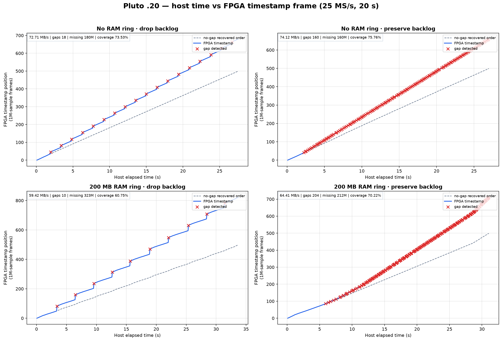
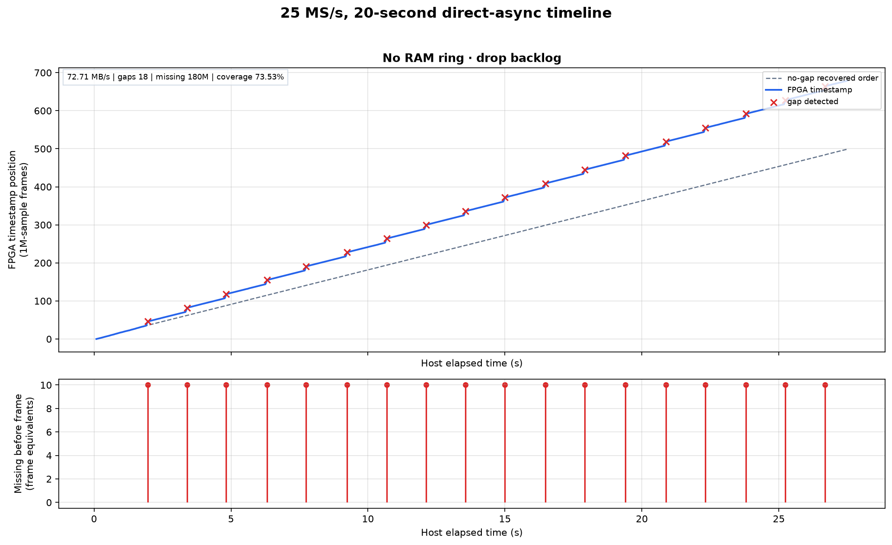
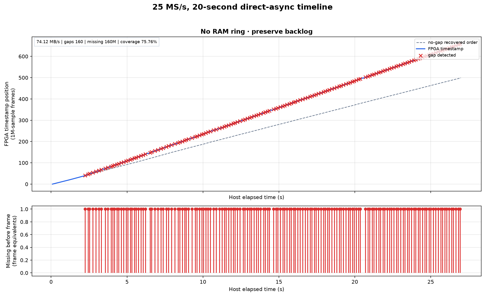
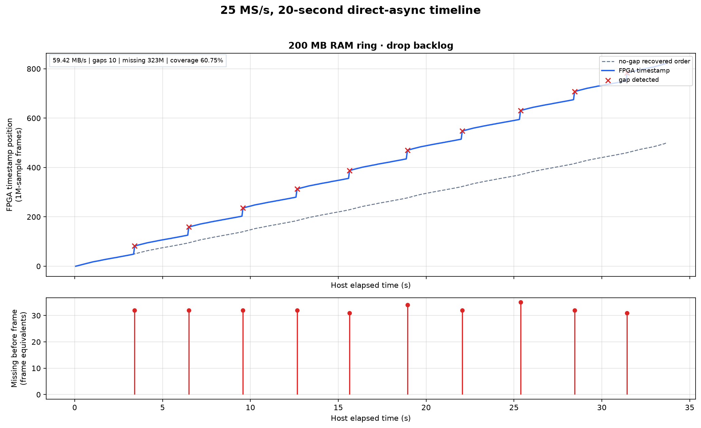
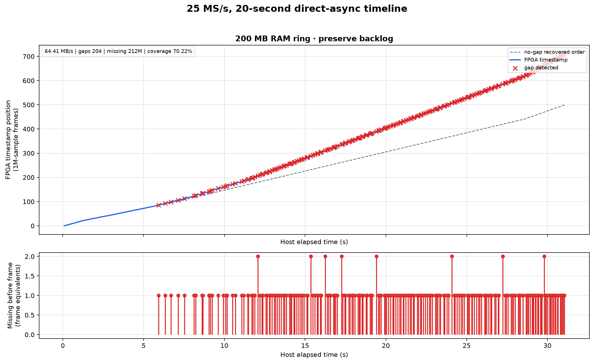

# Direct-async overrun policy: 20-second timeline comparison

- Test date: 2026-09-01 UTC
- Status: completed hardware A/B comparison
- Target: PlutoSDR+ at `192.168.1.20`, RX0 over physical Ethernet

## Executive result

Four single-session captures compared `drop-backlog` and `preserve-backlog`
with the RAM-ring extension disabled and with 200 MB of RAM capacity. Every
run transported all 500 requested 4 MB frames (2.000 GB) and restored the
radio settings. FPGA counters prove that all discontinuities occurred inside
the live session; there was no 64-frame teardown or request re-arm.

`drop-backlog` did what its name promises: it converted frequent small losses
into far fewer discontinuity events. It did **not** minimize missing samples.
For the 200 MB run, dropping reduced the event count from 204 to 10, but those
10 losses were 31--35 frames each and total missing samples rose from 212
million to 323 million.

The RAM extension is an opt-in burst buffer, not additional transport
bandwidth. In this sustained 25 MS/s overload, its 4 MB copies consumed radio
CPU/memory bandwidth and reduced application payload rate. The ring therefore
made neither policy's source coverage better in this particular run.



## Exact software and runtime

| Component | Exact version or ref | Commit |
| --- | --- | --- |
| persistent firmware | `v0.47-plutoplus-spf-iq-direct-async-v2` | `2bab87dcd9b18c8f957ae781603e88160c8509cc` |
| firmware Buildroot/rootfs | `iq-direct-async-v2-source/buildroot-v1` | `3e1dd15acf361cc06e202e9e59e907dd379a13c3` |
| firmware Linux/CMA geometry | `ddr-burst-v1-rc3-source/linux-v1` | `93174a1c049ca6ee42f042dbe93f0fb06fbc9cd7` |
| radio iiOD and host libiio | 0.25, `iq-direct-async-v2-source/libiio-v1` | `8f66f353c9a70a5524988ceb588b0e9271c2390d` |
| radio metadata provider | ABI 3, `RadioMetadataV6` | `3294365ff44da26b261be4a2ccb241b7896d23ad` |
| Pluto Plus Utils under test | `origin/main` | `a4c350e480085088012937ee5d6b6845b358da3e` |

The live radio process command was independently read back after the tests as:

```text
/usr/sbin/iiod -D -n 3 -F /dev/iio_ffs --rw-cpu-affinity 1
```

This matters because the earliest direct-async prototype measurements used
the older shorthand invocation `iiod -r 1`. This report describes the released
v2 image and its actual runtime, not that historical overlay.

## Controlled geometry

| Parameter | Value |
| --- | --- |
| sample rate and RF bandwidth | 25,000,000 samples/s and 25,000,000 Hz |
| selected receiver | RX0 only |
| tandem mode | HOLD |
| metadata/decoder | ABI 3, `RadioMetadataV6`, `raw-complex64` |
| transport | libiio IP/TCP to `192.168.1.20` |
| frame geometry | 1,000,000 samples, 4,000,000 wire bytes |
| direct-session target | 500 recovered frames, one session |
| recovered payload | 500,000,000 samples, 2,000,000,000 bytes |
| DMA queue | 12 kernel buffers |
| ringless cases | zero RAM slots and zero RAM bytes |
| RAM cases | 50 slots, exactly 200,000,000 admitted bytes |

“20 seconds” means 500 million **recovered** samples at 25 MS/s. Host capture
time is longer because Ethernet cannot transport the 100 MB/s source payload
at line rate. The FPGA source-time span is longer again when samples are lost.

The capture helper retained timing metadata only; it still called
`read_block()` for every 4 MB IQ block, so all 2 GB per run traversed the real
radio TCP and host decode path. No IQ payload is stored in this report.

## Metric definitions

- **Host elapsed time** is `CLOCK_MONOTONIC` time recorded immediately after
  each `read_block()` returns.
- **FPGA timestamp frame** is the frame's first-sample counter minus the first
  recovered sample counter, divided by 1,000,000 samples.
- **Gap event** is one returned frame whose authoritative
  `missing_samples_before` is nonzero.
- **Missing samples** is the sum of `missing_samples_before` across all 500
  frames.
- **Coverage** is `recovered_samples / (recovered_samples + missing_samples)`.
- The dashed plot line is the same 500 returned frames in ideal no-gap order.
  A blue vertical step is therefore missing FPGA source time, and a red cross
  marks the first returned frame after that loss.

## Results

| Queue and policy | Capture time | Payload | Gap events | Missing samples | Loss/event | Source span | Coverage |
| --- | ---: | ---: | ---: | ---: | ---: | ---: | ---: |
| no RAM, drop backlog | 27.508 s | 72.71 MB/s | 18 | 180M | exactly 10 frames | 27.20 s | 73.53% |
| no RAM, preserve backlog | 26.982 s | 74.12 MB/s | 160 | 160M | exactly 1 frame | 26.40 s | 75.76% |
| 200 MB RAM, drop backlog | 33.656 s | 59.42 MB/s | 10 | 323M | 31--35 frames | 32.92 s | 60.75% |
| 200 MB RAM, preserve backlog | 31.051 s | 64.41 MB/s | 204 | 212M | 1--2 frames | 28.48 s | 70.22% |

For ringless capture, dropping reduced the number of discontinuity events by
88.75% (160 to 18) while increasing missing samples by 12.5%. With 200 MB of
RAM, dropping reduced events by 95.10% (204 to 10) while increasing missing
samples by 52.36%.

These are single controlled runs, so small throughput differences should not
be treated as statistical confidence intervals. The event shapes and exact
counter closure are nevertheless direct observations, not estimates.

## Individual timelines

### Ringless, drop backlog



The direct DMA queue was cleared 18 times after overrun observation. Each
recovery skipped exactly ten 1-million-sample frames. The result is a small
number of regular staircase steps rather than a dense set of single-frame
losses.

### Ringless, preserve backlog



Preserving every queued frame produced 160 one-frame counter gaps. Because old
frames remain eligible for TCP transport, the host receives more source
history, but overrun continues to recur while transport remains slower than
the producer.

### 200 MB RAM ring, drop backlog



The ring recorded 383 RAM spills, 150 RAM drains, 233 RAM-backed evictions, a
28-frame high-water mark, and nine wraps. Ten drop events removed 31--35 source
frames each. The queue repeatedly charged and was then invalidated as a batch,
which explains the large, evenly spaced vertical steps.

### 200 MB RAM ring, preserve backlog



The ring reached its full 50-frame high-water mark and wrapped seven times. All
394 RAM spills were drained and none were evicted. The cost is a dense sequence
of 204 one- or two-frame losses after the finite reserve fills.

## Interpretation

The two policies answer different operational questions:

- `drop-backlog` (the firmware and host default) minimizes stale-data latency
  and the **number of discontinuity events**. On overrun detection it retains
  the frame already entering TCP, releases queued DMA/RAM frames, rebases gap
  metadata, and admits fresh frames until the original 500-frame target is met.
- `preserve-backlog` sends every already queued frame. It gives better source
  coverage in these runs, but reports many more individual gaps and delivers
  older data after congestion.

The RAM ring extends the same ordered descriptor FIFO; it is not a separate
capture session and it does not trigger periodic re-arming. Its benefit is
absorbing a bounded burst. Once sustained input exceeds sustained transport,
any finite queue must fill. The released RAM implementation also copies each
spilled 4 MB frame, so it can reduce throughput while it is active.

For an application that values freshness and fewer discontinuity boundaries,
the default drop policy is behaving correctly. For offline reconstruction that
values maximum source coverage, preserve mode is the better choice. Neither
policy can provide gap-free 25 MS/s capture over a path carrying only 59--74
MB/s of the required 100 MB/s payload.

## Closure and error checks

All four JSON reports passed these assertions:

- 500 requested frames, 500 recovered frames, and `segment_count == 1`;
- strict monotonic host times and FPGA counters;
- every counter transition closes exactly as
  `previous_end + missing_samples_before == next_first`;
- report gap totals equal the per-frame metadata totals;
- exact DMA count, RAM admission, and policy readback;
- both RAM cases ended `complete / target_complete / error_code=0`;
- all original radio settings were restored.

Postflight readback found zero active RX buffers, zero pending RX data, zero
tandem FIFO occupancy, zero tandem fault/overflow counts, and 66,826,240 of
67,108,864 CMA bytes free. iiOD remained generation 1 with the same PID; it was
not restarted to make a failed test appear clean.

## Pluto Plus Utils ladder on a newly flashed radio

No SSH session or manual iiOD command is required. The released firmware
starts supervised iiOD with `--rw-cpu-affinity 1` at every boot. All radio
identity, capability, capture, counter, and settings-restoration operations
below go through Pluto Plus Utils.

Start in the Pluto Plus Utils checkout containing the matched ABI-3 host
runtime. Set the exact physical-IP endpoint and serial, and create a private
directory for absent-only reports:

```bash
RADIO_IP=192.168.1.20
RADIO_SERIAL=1040005e0b100007100010000bf33a5d4d
LADDER_REPORT_DIR="$PWD/pluto-state/direct-async-ladder-20"

install -d -m 700 "$LADDER_REPORT_DIR"
```

First verify the host environment and discover only the intended endpoint:

```bash
uv run pluto environment --format json

uv run pluto radio inventory \
  --network-cidr "$RADIO_IP/32" \
  --format json
```

Do not start the ladder unless the output identifies the expected serial and
reports:

```text
firmware_version: v0.47-plutoplus-spf-iq-direct-async-v2
libiio_version: 0.25 (8f66f35)
healthy: true
```

### Standard release ladder

This one command runs the release matrix at 5, 10, 15, and 25 MS/s for 3 and
10 seconds. It uses the maximum-throughput ringless path, the default
drop-backlog policy, tandem HOLD, and the vectorized decoder:

```bash
uv run pluto radio direct-async-ladder "$RADIO_IP" \
  --transport ip \
  --expect-serial "$RADIO_SERIAL" \
  --rates 5M,10M,15M,25M \
  --durations 3,10 \
  --samples 1048576 \
  --kernel-buffers 15 \
  --ram-ring-slots 0 \
  --drop-backlog-on-overrun \
  --tandem-mode hold \
  --iq-decoder raw-complex64 \
  --format table \
  --report "$LADDER_REPORT_DIR/ringless-drop.json"
```

The command verifies the exact serial and ABI-3 capabilities, checks policy
readback, keeps each supported cell in one direct-async session, records
throughput and authoritative FPGA-counter gaps, and restores the original
settings. Protocol, readback, capture, or cleanup failures make the command
exit nonzero. Counter-observed gaps remain measured results rather than being
misreported as command failures.

### Four-way 25 MS/s, 20-second comparison

The following commands reproduce the queue and policy geometry used in this
report: 1,000,000 samples per 4 MB frame, 12 DMA buffers, and 500 recovered
frames in one session. Fifty RAM slots are exactly 200,000,000 bytes at this
frame size.

Ringless with drop-backlog:

```bash
uv run pluto radio direct-async-ladder "$RADIO_IP" \
  --transport ip --expect-serial "$RADIO_SERIAL" \
  --rates 25M --durations 20 \
  --samples 1000000 --kernel-buffers 12 \
  --ram-ring-slots 0 --drop-backlog-on-overrun \
  --tandem-mode hold --iq-decoder raw-complex64 \
  --format table \
  --report "$LADDER_REPORT_DIR/ringless-drop-20s.json"
```

Ringless with preserve-backlog:

```bash
uv run pluto radio direct-async-ladder "$RADIO_IP" \
  --transport ip --expect-serial "$RADIO_SERIAL" \
  --rates 25M --durations 20 \
  --samples 1000000 --kernel-buffers 12 \
  --ram-ring-slots 0 --preserve-backlog-on-overrun \
  --tandem-mode hold --iq-decoder raw-complex64 \
  --format table \
  --report "$LADDER_REPORT_DIR/ringless-preserve-20s.json"
```

The 200 MB RAM extension with drop-backlog:

```bash
uv run pluto radio direct-async-ladder "$RADIO_IP" \
  --transport ip --expect-serial "$RADIO_SERIAL" \
  --rates 25M --durations 20 \
  --samples 1000000 --kernel-buffers 12 \
  --ram-ring-slots 50 --drop-backlog-on-overrun \
  --tandem-mode hold --iq-decoder raw-complex64 \
  --format table \
  --report "$LADDER_REPORT_DIR/ram200-drop-20s.json"
```

The 200 MB RAM extension with preserve-backlog:

```bash
uv run pluto radio direct-async-ladder "$RADIO_IP" \
  --transport ip --expect-serial "$RADIO_SERIAL" \
  --rates 25M --durations 20 \
  --samples 1000000 --kernel-buffers 12 \
  --ram-ring-slots 50 --preserve-backlog-on-overrun \
  --tandem-mode hold --iq-decoder raw-complex64 \
  --format table \
  --report "$LADDER_REPORT_DIR/ram200-preserve-20s.json"
```

Report paths must be absent; use a new private directory for every campaign.
For the second released radio, use a separate directory and change the exact
identity variables to:

```bash
RADIO_IP=192.168.1.21
RADIO_SERIAL=10400056f695001322002d0010ad1719f2
LADDER_REPORT_DIR="$PWD/pluto-state/direct-async-ladder-21"

install -d -m 700 "$LADDER_REPORT_DIR"
```

The four Pluto Plus Utils ladder reports contain aggregate throughput, gap,
missing-sample, overflow, and RAM accounting for each cell. The per-frame timing
arrays used for the PNGs in this report are intentionally collected by the
bounded metadata-only helper below; the ladder does not retain IQ payloads.

## Reproduction and evidence

[`capture_direct_async_timeline.py`](capture_direct_async_timeline.py) performs
one metadata-only capture and writes an absent-only, mode-0600 JSON report.
[`plot_direct_async_time_comparison.py`](plot_direct_async_time_comparison.py)
validates four inputs and generates the individual and combined figures.

An example ringless drop run is:

```bash
uv run python reports/2026-09-01-direct-async-overrun/capture_direct_async_timeline.py \
  --uri ip:192.168.1.20 --serial EXACT_SERIAL \
  --kernel-buffers 12 --ram-ring-slots 0 \
  --drop-backlog-on-overrun --duration-seconds 20 \
  --report /private/ringless-drop.json
```

Change the policy flag to `--preserve-backlog-on-overrun`. For the RAM cases,
set `--ram-ring-slots 50`; at this geometry that is exactly 200,000,000 bytes.

The committed per-frame records are:

- [`ringless-drop.json`](ringless-drop.json)
- [`ringless-preserve.json`](ringless-preserve.json)
- [`ram200-drop.json`](ram200-drop.json)
- [`ram200-preserve.json`](ram200-preserve.json)

[`SHA256SUMS`](SHA256SUMS) binds every script, JSON record, and PNG in this
directory. The JSON files contain no IQ samples or credentials.
