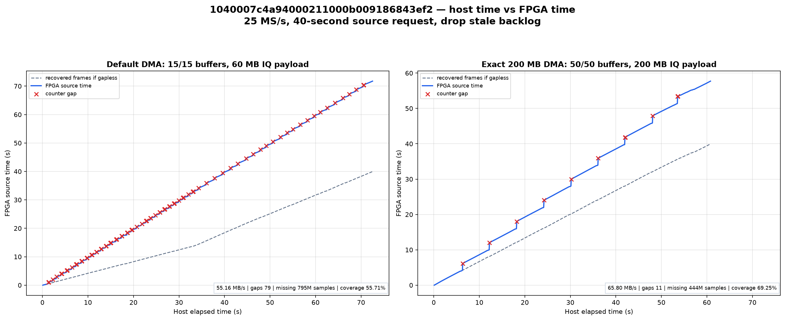
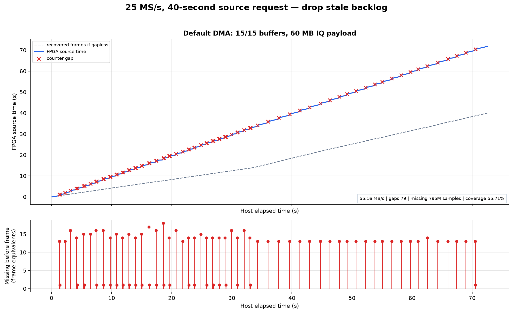
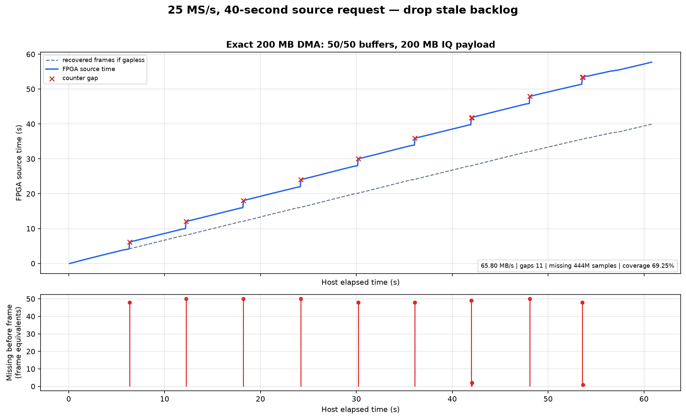

# Direct-async v4: authoritative DMA admission and exact 200 MB queue

## Outcome

Firmware `v0.49-plutoplus-spf-iq-direct-async-v4` closes the ambiguity behind
the earlier “15 versus 47 buffers” comparison. The radio now reports the
number of DMA blocks the kernel actually allocated, and iiOD refuses a direct
session unless that number exactly equals the request. The qualified geometry
is 50 buffers × 1,000,000 CI16 IQ samples × 4 bytes = exactly 200,000,000 IQ
payload bytes. RAM-ring slots were disabled in both comparison runs.

On serial `1040007c4a94000211000b009186843ef2` over physical
`192.168.1.18`, both 40-second 25 MS/s requests returned all 1,000 requested
frames in one session with drop-backlog enabled and exact RF-setting restore.
The 200 MB queue reduced gap-bearing frames from 79 to 11 (86.1%), reduced
counter-proven missing samples from 795 million to 444 million (44.2%), and
raised source coverage from 55.71% to 69.25%.



## Root cause and fix

V0.48 exposed only the requested kernel-buffer count. Linux could partially
allocate an IIO block queue and libiio would still return a usable buffer, so
iiOD and PPU reported a request such as 47 even when the radio held only 12
blocks. Page alignment made the old arithmetic particularly misleading:
1,048,576 ABI-3 IQ samples require an additional metadata prefix and map as
1,025 pages. With one-MiB CMA alignment, repeating that shape leaves alignment
holes between blocks.

V0.49 changes every layer:

1. local libiio records and exposes the actual number of mapped kernel blocks;
2. iiOD passes the actual count to the metadata provider and refuses direct
   async with `ENOSPC` when requested and allocated counts differ;
3. iiOD advertises `iio,buffer-direct-async-exact-kernel-queue=1`;
4. host libiio and PPU require that capability and report requested/allocated
   counts separately; and
5. Linux reserves 216 MiB CMA with one-MiB alignment, allowing fifty aligned
   four-MiB mappings plus 16 MiB headroom.

The hardware red/green boundary is explicit. A request for 47 × 1,048,576
samples passed the old payload-byte estimate but the real aligned allocation
could not be exact, so v0.49 returned `ENOSPC`. The qualified 50 × 1,000,000
request then reported `requested=50, allocated=50` and completed.

## Exact tested stack

| Layer | Immutable version |
| --- | --- |
| firmware source/build | `bc00edb8c340dd4f9b04361398cbd2c8edcc9cae`; trusted run `33535095284` |
| Buildroot/rootfs | `2e146948a52eaf7c7f675c5e6ac746eeff4aacac`; `iq-direct-async-v4-source/buildroot-v1` |
| radio and host libiio 0.25 | `5cb2389719d46d12463daa0371d1fda19eb25fa7`; `iq-direct-async-v4-source/libiio-v1` |
| libiio source archive | SHA-256 `1f38c05259c846b9f6ef327eb8feab293564a615d940336a8b4491c79e403212` |
| Linux | `7176508dd84bde78c62d8790bbd17957fdda12d7`; `iq-direct-async-v4-source/linux-v1` |
| metadata provider | ABI 3, `3294365ff44da26b261be4a2ccb241b7896d23ad` |
| HDL | `145bd47e55d5c5537e0ba49d53cb25a5393f66ba` |
| U-Boot | `1ff0468e9bea29b0a768a7bf52db8d025c521b9a` |
| PPU capture/profile | `faf9a2a01daf92eb2e7ebea02cf6bb653303b82c` / `35a827c0f8d6255fa29646c75ea191492e403b69` |

The live radio reported 216 MiB CMA (`CmaTotal: 221184 kB`) and supervised
`/usr/sbin/iiod -D -n 3 -F /dev/iio_ffs --rw-cpu-affinity 1`. Operators do not
start another iiOD process.

## Forty-second comparison

“40 seconds” means one billion recovered IQ samples, not 40 seconds of wall
time. A 25 MS/s CI16 source offers 100 MB/s, so source time advances faster
than a slower consumer whenever counter-proven samples are lost.

| Profile | Admission | DMA IQ bytes | App payload | Gap frames | Missing samples | Coverage |
| --- | ---: | ---: | ---: | ---: | ---: | ---: |
| default | 15/15 | 60,000,000 | 55.16 MB/s | 79 | 795,000,000 | 55.71% |
| exact 200 MB | 50/50 | 200,000,000 | 65.80 MB/s | 11 | 444,000,000 | 69.25% |

The larger queue does not increase Ethernet line rate. It takes longer to
fill, so drop-backlog fires much less often and each staircase is farther
apart. When it does fire, only queued-but-unsent frames are released; the
frame already entering TCP remains intact and the same 1,000-frame session
continues.





The exact 200 MB run's radio `transport_iq` timing was 56.430091394 seconds
for 4.000 GB, or **70.884 MB/s radio TCP payload**. Its end-to-end application
rate was lower because the shared host was concurrently running CPU- and
memory-intensive Vivado/qualification workloads. Short PPU cells on the same
bytes reached 70.12, 70.25, 71.51, and 72.98 MB/s, but repeated cells under
the shared load also fell below 70 MB/s. This report therefore distinguishes
the passed radio transport gate from host-load-sensitive application timing.

## Reproduction

Install the matched host runtime first; `pluto environment` must report
`libiio 0.25 (5cb2389)`. Then run each profile with the retained helper:

```bash
uv run python \
  reports/2026-09-01-iq-direct-async-v4-exact-200m/capture_dma_timeline.py \
  --uri ip:RADIO_IP --serial RADIO_SERIAL \
  --kernel-buffers 15 --sample-rate-hz 25000000 \
  --samples-per-frame 1000000 --duration-seconds 40 \
  --ppu-commit PPU_COMMIT --report /ABSOLUTE/PATH/default-15-dma.json

uv run python \
  reports/2026-09-01-iq-direct-async-v4-exact-200m/capture_dma_timeline.py \
  --uri ip:RADIO_IP --serial RADIO_SERIAL \
  --kernel-buffers 50 --sample-rate-hz 25000000 \
  --samples-per-frame 1000000 --duration-seconds 40 \
  --ppu-commit PPU_COMMIT --report /ABSOLUTE/PATH/exact-200mb-50-dma.json
```

Regenerate all three PNGs:

```bash
uv run --with matplotlib python \
  reports/2026-09-01-iq-direct-async-v4-exact-200m/plot_dma_timeline.py \
  --default /ABSOLUTE/PATH/default-15-dma.json \
  --dma-200mb /ABSOLUTE/PATH/exact-200mb-50-dma.json \
  --output-dir /ABSOLUTE/PATH/plots
```

The helpers require exact admission, verify requested equals allocated, force
RAM slots to zero, require drop-backlog, validate every FPGA counter closure,
and restore the original RF settings in a `finally` path.
