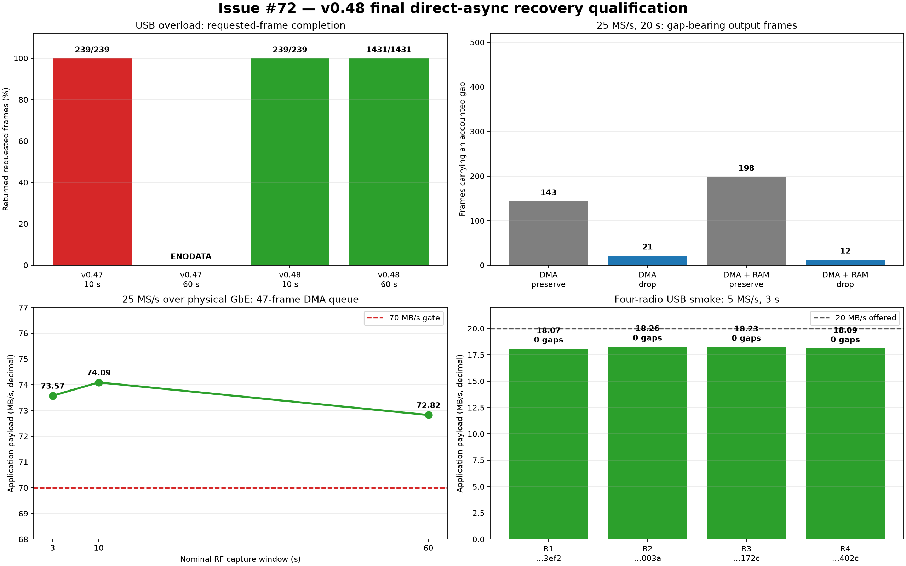

# Issue #72 direct-async recovery qualification

## Outcome

Full release `v0.48-plutoplus-spf-iq-direct-async-v3` fixes the long-session
`ENODATA` failure reproduced on v0.47. Under a deliberately overloaded USB
Ethernet path, the implementation candidate returned every requested frame in
both 10-second and 60-second sessions. The exact protected-main release bytes
were then RAM-booted on four serial/path-bound radios and tested over physical
1 GbE. The 47-frame direct DMA queue delivered 73.57, 74.09, and 72.82 MB/s for
3-, 10-, and 60-second 25 MS/s captures. The 60-second result is one
1,431-frame, 6.002 GB session; it did not segment, re-arm, or return `ENODATA`.

After all volatile and performance gates passed, PPU persistently installed
the same DFU/FIT bytes on `winbond-db6968136727402c`. The radio returned as
v0.48/AD9361/TX-safe, `/dev/mtd3` matched the qualified FIT hash, a separate
guarded reboot returned the same identity, and repeat reconciliation plus a
gapless post-reboot capture passed.



This is a capture-completion and loss-accounting result. A 25 MS/s CI16 source
offers 100 MB/s, so gaps remain whenever the consumer is slower. The fix does
not fabricate continuity: every discontinuity remains represented by the FPGA
sample counter and `missing_sample_count`.

## Root cause and fix

The SPF gain/RSSI timeline has a finite coverage window. During a long direct
session under backlog pressure, a DMA frame can age beyond that coverage before
iiOD asks the metadata provider to describe it. V0.47 returned `ENODATA` for
this condition and the direct producer treated it as terminal, ending the host
request even when `drop-backlog` was selected.

The v0.48 stack makes the condition explicit and recoverable:

1. the SPF provider returns `ESTALE` when either gain or RSSI coverage is no
   longer available for a real IQ frame;
2. in `drop-backlog` mode, iiOD retires the uncovered frame, frees every
   queued-but-unsent frame, and continues filling the same finite request;
3. the in-flight TCP frame is never withdrawn, and the host target is not
   shortened;
4. a valid frame resets the stale streak; more than `DMA capacity + 8`
   consecutive stale frames still fail closed with `ESTALE`; and
5. host libiio snapshots terminal status before cancelling a failed direct
   socket, so PPU can report the radio's last status after an exception.

`preserve-backlog` remains fail-closed when metadata cannot be proven. The
status reason currently uses the protocol's broad `dma_error` bucket, while
the exact `error_code=-116` identifies `ESTALE`.

## Exact tested stack

| Component | Exact tested version |
| --- | --- |
| protected firmware build | `e3078376a6e1a8c6ea841dc69966b3880e020c70`; run `33481347855` |
| recovery implementation ancestor | `322b67f9580d215c1f8362735c877f7c5ee2f89e` |
| Buildroot/rootfs | `1c337a0b8d8126c9d1ed785607bc5ea52e7fed22` |
| radio iiOD and host libiio | 0.25 at `0d323080a0a1067da8c7adbadfd03ee186a40ec2` |
| PPU terminal-status/runtime pin | `7ff398aa67b36f5b5f3978153674c1b46c836110` |
| PPU 200 MB DMA ladder guard | `7d412dfc60f7ad58601092b7332b21a74d5a3ff0` |
| PPU exact release RAM profile | `1287462dca2dfd6d06ca192e3c8c37eabb64181a` |
| PPU persistent promotion | `0a21ce250b44006a7880ae35dc30d11673fd2180` |
| SPF metadata provider | ABI 3, `3294365ff44da26b261be4a2ccb241b7896d23ad` |
| HDL | `145bd47e55d5c5537e0ba49d53cb25a5393f66ba` |
| Linux | `93174a1c049ca6ee42f042dbe93f0fb06fbc9cd7` |
| U-Boot | `1ff0468e9bea29b0a768a7bf52db8d025c521b9a` |

The release DFU is 12,825,587 bytes with SHA-256
`cc87c36a3aad609a64b45f4a02eecf916b99a3099fa523eed1bf4526ed98995a`;
its 12,825,571-byte FIT body is
`db777ac93d5c6f0be0cf2799808a4d06fe39264ee1e99e76001509394d75f1df`.
The protected source tarball is SHA-256
`4839ef4e97b2c7d2f56363219184ec48db8fbdab67f1b6d8388f531ca79836fd`.
The image reports `--rw-cpu-affinity 1`, which is the supervised equivalent of
the historical `iiod -r 1` shorthand.

Host ABI 3 must use the matching native library and generated Python binding:

```bash
scripts/install_native_libiio.sh \
  --uv-bin "$HOME/.local/bin/uv" \
  --metadata-abi 3
uv run pluto environment
```

The expected environment line is `libiio version 0.25 (0d32308)`. The installer
fetches the full immutable SHA and writes a content-bound runtime receipt; PPU
rejects a different loaded library even if its version string looks similar.

## Red/green long-session result

Both runs used 25 MS/s, 1,048,576 samples/frame, 11 DMA frames, 32 RAM slots
(128 MiB), `drop-backlog`, and the same local USB Ethernet path.

| Firmware | Window | Result | Payload | Gap frames | Missing samples |
| --- | ---: | --- | ---: | ---: | ---: |
| v0.47 | 10 s | 239/239 | 19.783 MB/s | 30 | 904,921,088 |
| v0.47 | 60 s | **terminal `ENODATA`** | — | — | — |
| v0.48 | 10 s | 239/239 | 19.827 MB/s | 35 | 921,698,304 |
| v0.48 | 60 s | **1,431/1,431** | 19.517 MB/s | 218 | 6,063,915,008 |

The USB link intentionally cannot keep pace. Success here means that v0.48
kept one direct session alive, returned the finite target, and accounted for
loss instead of aborting.

## Twenty-second final-byte policy matrix

| Queue | Policy | Result | Gap frames | Missing samples | Payload |
| --- | --- | --- | ---: | ---: | ---: |
| 11 DMA | preserve | 477/477 | 143 | 153,092,096 | 75.016 MB/s |
| 11 DMA | drop | 477/477 | 21 | 178,257,920 | 72.779 MB/s |
| 11 DMA + 128 MiB RAM | preserve | 477/477 | 198 | 213,909,504 | 65.606 MB/s |
| 11 DMA + 128 MiB RAM | drop | 477/477 | 12 | 298,844,160 | 60.311 MB/s |

Ringless drop mode reduced the number of gap-bearing frames by 85.3%. With RAM,
it reduced them by 93.9%. Every final-byte run returned all 477 requested
frames. Drop mode did not reduce missing sample count: retiring the stale queue
intentionally creates fewer, larger discontinuities and returns to fresher RF
time sooner. The RAM preserve run filled all 32 slots and drained all 365
spilled frames. RAM drop spilled 357, drained 155, and explicitly retired 202;
`spilled = drained + dropped`.

RAM slots extend the existing ordered queue. They do not create a second DMA
session, and reaching RAM high-water does not clear the in-flight TCP frame or
re-arm capture.

## Physical-GbE performance

The full RAM-ring ladder was gap-free through 15 MS/s. At 25 MS/s, RAM copies
limited the 3- and 10-second cells to 69.42 and 60.25 MB/s. That configuration
therefore failed the 70 MB/s performance gate even though it completed both
requests.

The intended performance profile is ringless with 47 × 4 MiB DMA frames:
197,132,288 bytes, below the radio's 200,000,000-byte advertised limit. PPU
commit `7d412df` replaces an obsolete 64 MiB host-only guard and still rejects
48 frames (201,326,592 bytes) before opening the radio.

| Window | Returned | Payload | Gap frames | Missing samples |
| ---: | ---: | ---: | ---: | ---: |
| 3 s | 72/72 | **73.571 MB/s** | 2 | 20,971,520 |
| 10 s | 239/239 | **74.088 MB/s** | 7 | 73,400,320 |
| 60 s | 1,431/1,431 | **72.823 MB/s** | 53 | 552,599,552 |

Example PPU-only performance command for a newly flashed radio:

```bash
uv run pluto radio direct-async-ladder RADIO_IP \
  --transport ip \
  --expect-serial RADIO_SERIAL \
  --rates 25M \
  --durations 3,10,60 \
  --channels rx0 \
  --samples 1048576 \
  --kernel-buffers 47 \
  --ram-ring-slots 0 \
  --drop-backlog-on-overrun \
  --tandem-mode hold \
  --iq-decoder pyadi \
  --format json \
  --report "$PRIVATE_REPORT_DIRECTORY/25m-k47-drop.json"
```

For the complete lower-rate ladder, replace `--rates 25M` with
`--rates 5M,10M,15M,25M` and use `--durations 3,10`.

## Fleet and compatibility checks

The exact protected-build DFU was RAM-booted with PPU on four serial/path-bound
local USB radios. Every receipt attested v0.48, AD9361, and TX-safe state
without writing QSPI. Each radio then returned 15/15 frames at 5 MS/s over its
isolated USB Ethernet route with zero gaps, zero missing samples, and zero
overflow; payload rates ranged from 18.070 to 18.259 MB/s.

On serial `winbond-db6968136727402c`, ordinary dual-RX capture kept pace at
2.5 and 5 MS/s (20.012 and 40.046 MB/s). A bounded PPU Fast Lock probe tuned
ordinary and volatile-profile paths between 2.4 and 5.8 GHz, verified the
5.8 GHz ordinary readback, kept TX muted, and restored the exact original RF
settings.

## Persistent installation and reboot evidence

PPU profile `iq-direct-async-v3-release-persistent-promotion` authorized only
the exact final DFU/FIT hashes above. A serial/path-bound mass-storage flash on
`winbond-db6968136727402c` completed all write, sync, eject, disappearance,
return, identity, and TX-safe phases under receipt
`016eb590-5fb4-42e3-9568-afe0f4d4254c`.

Read-only reconciliation hashed exactly 12,825,571 bytes from `/dev/mtd3` and
matched `db777a…d1df`. Guarded reboot receipt
`7605359b000b474994626df2e602691b` then proved same-topology return as v0.48
with AD9361, paired RX, tandem AGC, and muted TX. Because Pluto generates SSH
host keys at boot, PPU enrolled a new serial-specific key after return and
repeated `/dev/mtd3` reconciliation. The final post-reboot 5 MS/s test returned
15/15 frames at 19.026 MB/s with zero gaps.

This is a persistent software-reboot qualification. It is not described as an
all-power-removed cold boot; the v0.47 release remains the independently
cold-boot-qualified rollback image.

## Reproduction and retained data

[`data.json`](data.json) is the compact canonical input to
[`plot_recovery_summary.py`](plot_recovery_summary.py). Regenerate the figure
from the repository's locked environment:

```bash
uv run --with matplotlib python \
  reports/2026-09-01-issue-72-direct-async-recovery/plot_recovery_summary.py
```

Raw PPU reports and serial-bound deployment/isolation receipts remain in the
private qualification archive. They are intentionally not copied into the
public repository because they contain host topology and local absolute paths.
Canonical report hashes include `162dd057…65d` for the physical-GbE 3/10/60 s
gate, `88680d86…34b` for the RAM ladder, `f33fa412…24d2` / `2bd524e9…b74e` /
`0d77b56f…64a3` / `963a60f8…97ed` for the four-way matrix, and
`e8659e0e…f096` / `bd427436…faec` for persistent flash and reboot receipts.
